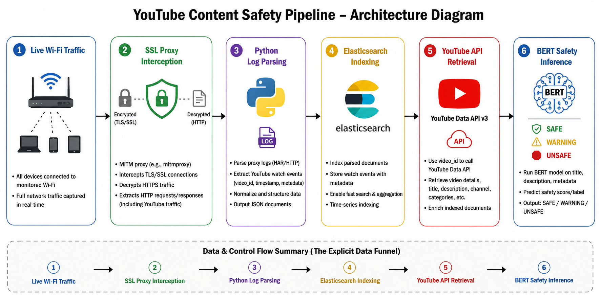

# YouTube Safety Index Pipeline

A real-time network traffic interception, ETL ingestion, and NLP classification pipeline designed to monitor household streaming logs and proactively identify unsafe video content for children. 
Instead of relying on rigid, restrictive blocklists, this architecture focuses on **transparent monitoring and visibility**, capturing live data frames, parsing video metadata, and evaluating transcripts via machine learning baselines and transformer models.


## System Architecture & Data Funnel

The pipeline functions as an automated end-to-end data funnel divided into four distinct phases:

1. **Traffic Capture & Interception:** household Wi-Fi traffic is monitored via a proxy configuration (you can use postman or manually configured proxy) using SSL bumping/decryption to intercept secure YouTube endpoint frames.
   * *Infrastructure evolution:* the baseline architectural proof-of-concept was engineered from scratch by compiling a custom proxy instance to handle low-level network packet routing, port forwarding, and raw SSL decryption tables. For accelerated testing and reproduction of this code, an automated proxy client (e.g., Postman) can be used as the capturing layer - i, personally, prefer the former for its high scalability & infrastructure depth

2. **Log Extraction & Indexing (ETL):** key communication logs are captured, stripped down to specific network identifiers (including unique YouTube Video IDs), and securely streamed into an Elasticsearch cluster.
3. **Metadata Harvesting & Enrichment:** an automated Python workflow extracts the staged IDs, queries the YouTube Data API for rich video metadata, and dynamically retriebe raw closed-caption text fields.
4. **Safety Risk Classification (NLP):** enriched text structures undergo tokenization, lexicon analysis, and sentiment evaluation before passing into machine learning classifiers to isolate violent, explicit, or abusive content.


## Files Structure

```text
youtube-safety-index-pipeline/
│
├── data-ingestion-etl/
│   └── extract_es_traffic_ids.py       # Interfaced with ES cluster to isolate video log IDs
│
├── metadata-harvesting/
│   └── harvest_youtube_transcripts.py  # Automated transcript retrieval & API enrichment
│
├── nlp-classification/
│   └── baseline_feature_classifiers.py # Automated lexicon parsing, VADER sentiment, & ML baselines
│
└── config/
    └── certs/
        └── http_ca.crt                 # Placeholder for SSL/TLS Cluster Certificates
```

## Pipeline Component Breakdown

### 1. Data Ingestion & ETL (`extract_es_traffic_ids.py`)
This component establishes a secure connection to a local Elasticsearch cluster hosting intercepted log traffic (`postman_logs_v3`).
* **Engineering Best Practices:** Features robust error checking via custom network handshakes, automated index presence verification (`es.ping()`), custom certificate authority configuration mappings, and strict request timeouts to prevent ingestion blocking.
* **Security & Cleanliness:** Avoids hardcoded authentication schemas by routing cluster initialization variables through standardized environment access arrays (`os.getenv`).
* **Output:** Extracts and stages a pristine manifest array of unique video strings for downstream processing.

### 2. Metadata Harvesting & Enrichment (`harvest_youtube_transcripts.py`)
Takes the staged logs and executes external network enrichment via the **YouTube Data API**.
* **Defensive Engineering:** The script wraps the transcription library inside a granular, targeted `try/except` loop catching specific `TranscriptsDisabled` and `NoTranscriptFound` exceptions. Instead of crashing on uncaptioned videos, the pipeline gracefully logs a `"Transcript not available"` fallback string and moves forward.
* **Output:** Generates raw structured JSON backups along with structured tabular matrices for direct feature engineering.

### 3. NLP Safety Classification (`baseline_feature_classifiers.py`)
Decouples raw, unstructured text strings into a deterministic multi-tiered safety feature matrix:
* **Lexicon Matching:** Scans text arrays against specific continuous threat vocabularies (violence and abuse indicators).
* **Contextual Sentiment Distribution:** Integrates a VADER Sentiment Analyzer to detect intense negative sentiment context.
* **Probabilistic Profanity Validation:** Deploys a baseline `profanity_check` model to flag explicit content.
* **Evaluation Baselines:** Feeds engineered vectors into K-Nearest Neighbors (KNN) and Random Forest Ensemble models to determine risk thresholds.

> **Architectural Note on Deep Learning Scaling:**
> While classical machine learning models (KNN/Random Forest) serve as highly efficient, low-latency baseline screeners in this repository, production scaling passes these engineered feature arrays directly into a downstream, fine-tuned `BERT-base-uncased` transformer context model to maximize risk recall.


## Operational Performance & Model Metrics

* **Proxy Server Efficiency:** Successfully processed live network streams with an average handling latency of **250ms per request**, preventing any observable drag on user browsing experience.
* **NLP Model Target Metrics:** Because a missed threat (a false negative) is highly critical in a child-safety application, downstream optimization prioritized threat identifier recall over generic accuracy:
  * **Overall Accuracy:** 83% across test distributions.
  * **Weighted Average F1-Score:** 0.83
  * **Unsafe Content F1-Score:** **0.88** (reflecting a robust, reliable balance in isolating problematic material).


## Setup & Environment Configuration

### Prerequisites
* Python 3.10+
* Running Elasticsearch Instance (configured to read network proxy capture logs)

### Environment Variables
To secure cluster integrations, authentication parameters must be managed via local environment states rather than hardcoded scripts:
```bash
export ES_PASSWORD="your_secure_elasticsearch_password"
```
### Installation

1. Clone the repository and install the underlying runtime packages:
   ```bash
   pip install elasticsearch youtube-transcript-api pandas scikit-learn vaderSentiment profanity-check
   ```
2. Place your YouTube Developer Key inside a centralized configuration file named YT_API_KEY.py as:
   ```bash
   YT_AUTH = 'YOUR_API_KEY'
   ```
3. Execute the pipeline steps sequentially to process the data funnel:
   ```bash
   python data-ingestion-etl/extract_es_traffic_ids.py
   python metadata-harvesting/harvest_youtube_transcripts.py
   python nlp-classification/baseline_feature_classifiers.py
   ```  
